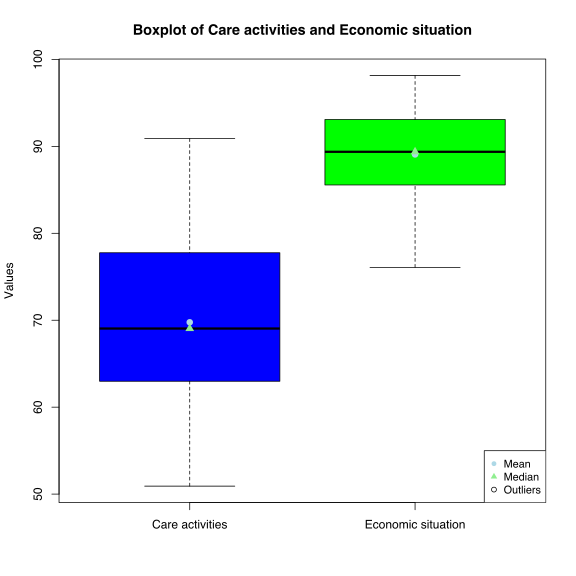
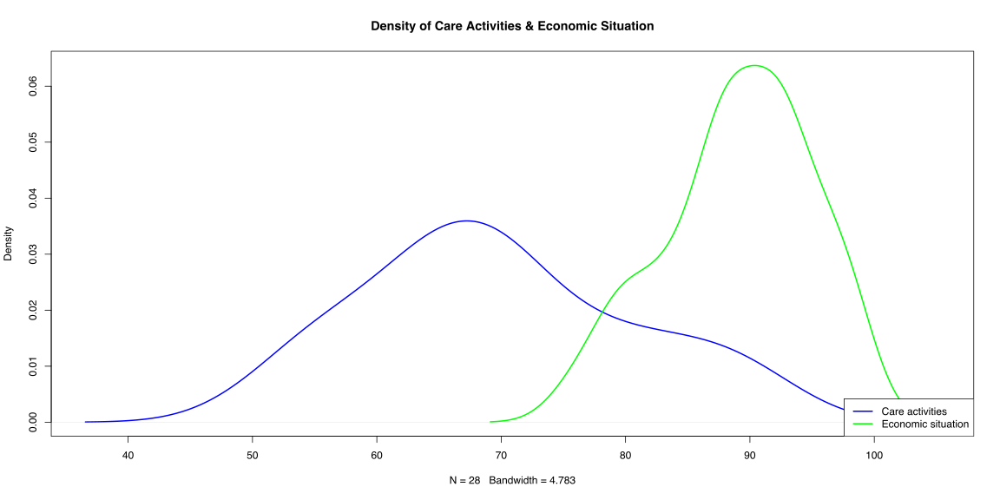
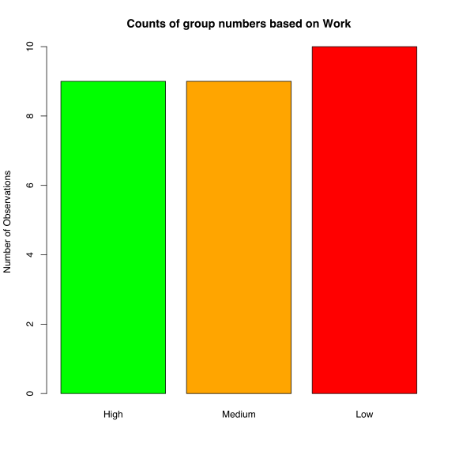
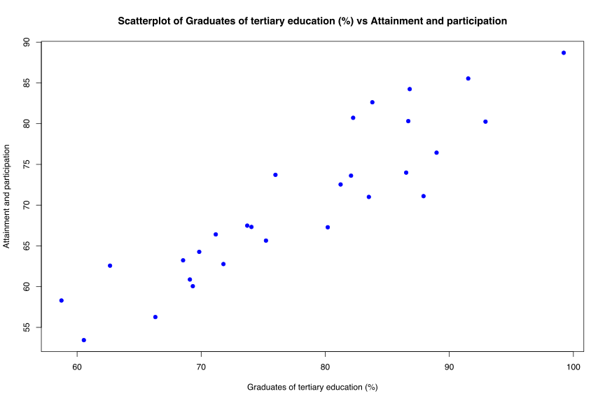

# ADA ISI - Project

This R script was developed as part of a faculty project with the objective of applying statistical hypothesis testing to a real dataset. The analysis includes descriptive statistics, graphical data exploration, and inferential statistical methods in order to examine relationships between variables and test predefined statistical hypotheses.

## Boxplot

## Density Plot

## Barplot

## Scatter Plot

